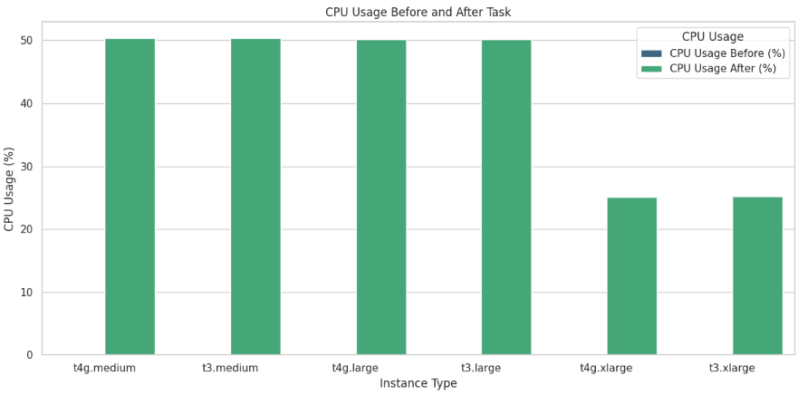

# AWS 인스턴스 성능 비교

성능 비교를 위해 AWS 인스턴스 유형별로 **CPU 사용 전후 및 작업 처리 시간**을 측정하였습니다.

<details>
<summary> test.py </summary>

```python

import time
import psutil
import csv
import os

# 작업 정의
def cpu_intensive_task():
    [x**2 for x in range(10000000)]

# 성능 측정 및 CSV 파일 저장
def measure_and_save_performance(csv_file):
    cpu_usage_before = psutil.cpu_percent()
    start_time = time.time()
    cpu_intensive_task()
    cpu_usage_after = psutil.cpu_percent()
    end_time = time.time()

    # 데이터 준비
    data = {
        'CPU Usage Before (%)': cpu_usage_before,
        'CPU Usage After (%)': cpu_usage_after,
        'Task Duration (seconds)': end_time - start_time,
    }

    # CSV 파일이 존재하지 않으면, 헤더와 함께 새 파일 생성
    file_exists = os.path.isfile(csv_file)
    with open(csv_file, 'a', newline='') as csvfile:
        writer = csv.DictWriter(csvfile, fieldnames=data.keys())
        if not file_exists:
            writer.writeheader()
        writer.writerow(data)

# 파일명 지정 및 함수 호출
csv_file = 'aws_instance_performance.csv'
measure_and_save_performance(csv_file)

```
</details>


## 성능 비교 표

### 공통 사양: 2vCPU, 4GiB


| 인스턴스 유형 | 아키텍처 | CPU 사용 전 (%) | CPU 사용 후 (%) | 작업 처리 시간 (초) |
|---------------|----------|------------------|------------------|----------------------|
| t4g.medium    | Arm      | 0.0              | 50.2             | 3.193                |
| t3.medium    | x86      | 0.0              | 50.2             | 3.776                |

### 공통 사양: 2vCPU, 8GiB

| 인스턴스 유형 | 아키텍처 | CPU 사용 전 (%) | CPU 사용 후 (%) | 작업 처리 시간 (초) |
|---------------|----------|------------------|------------------|----------------------|
| t4g.large     | Arm      | 0.0              | 50.1             | 3.200                |
| t3.large     | x86      | 0.0              | 50.1             | 3.402                |

### 공통 사양: 4vCPU, 16GiB
| 인스턴스 유형 | 아키텍처 | CPU 사용 전 (%) | CPU 사용 후 (%) | 작업 처리 시간 (초) |
|---------------|----------|------------------|------------------|----------------------|
| t4g.xlarge    | Arm      | 0.0              | 25.1             | 3.198                |
| t3.xlarge     | x86      | 0.0              | 25.2             | 2.960     

## 성능 비교 그래프
### CPU 사용량 비교


### 작업 시간 비교
