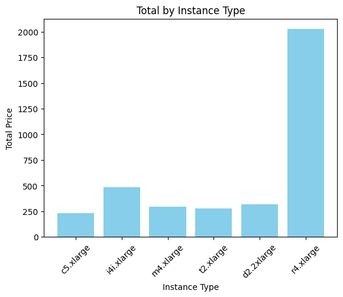

# 🚩 Namo 팀 인스턴스 별 성능비교

## 각 인스턴스의 특징

1. **m4**: 범용 사용을 위한 인스턴스.
   웹 서버 및 코드 리포지토리와 같이 이러한 리소스를 동등한 비율로 사용하는 애플리케이션에 적합합니다.
2. **i4i**: 인텔 Xeon 프로세서와 4GB의 인스턴스 메모리를 제공합니다.
3. **t2**: 일반용 티 모드 인스턴스로 저렴한 비용으로 제공됩니다.
4. **r2**: 메모리 중심의 최적화된 인스턴스로 메모리 및 CPU가 향상되었습니다.
5. **c5**: 컴퓨팅 집중형 워크로드를 위한 최신 세대의 인스턴스입니다.
6. **d2**: 디스크 집중형 워크로드를 위한 대용량 디스크를 제공하는 인스턴스입니다.

## 실행 방법

1. 각 인스턴스에 접속
2. 리눅스 CLI에서 원하는 폴더를 만들고, C 파일 생성
3. C 파일을 컴파일하여 실행
4. 각 실행 시간을 비교/분석 및 시각화

# 주제

## 성능 측정을 위한 C 언어 실행

본 프로젝트는 여러 인스턴스에서 C 언어로 작성된 정렬 알고리즘 코드의 실행 시간을 측정하고자 합니다. 각 인스턴스는 다음과 같은 특징을 가지고 있습니다.

<br>

### 2. 인스턴스 유형

`c5`&nbsp; / &nbsp; `i4i`&nbsp; /&nbsp; `m4` / &nbsp; `t2` / &nbsp; `r2` / &nbsp; `d2`

### 유형별 크기

- CPU별 비교를 위해 유형별 크기는 xlarge로 통일

## 인스턴스 환경

- OS
  - Canonical, Ubuntu, 22.04, ams64 jammy image
- 스토리지
  - (32G, gp3)

<br>

## 결과 시각화

각 인스턴스에서 실행한 코드의 실행 시간을 시각화하여 비교합니다. 또한 각 인스턴스의 온디맨드 요금을 시각화하여 비교합니다

### 인스턴스 별 정렬 알고리즘 실행시간


### 인스턴스 별 정렬 알고리즘 총 실행시간


### 인스턴스 별 온디맨드 가격(kor)



# 결론

- 성능 비교시 사용한 코드의 인아웃풋이 많지 않아서
  유의미한 비교가 어렵다.
  추후 더 복잡한 시스템을 통해 확인할 예정
- 연산의 성능이 가장 크게 고려되는 상황에선 c5를 사용하는 것이
  실행시간 측면에서 효율적이다.

<br>

# 크롤링 코드

```c
#include <stdio.h>
#include <time.h>
#include <stdlib.h>
#include <memory.h>
#define ARR_SIZE 100000

//Create 100000 random number
void random_arr(int random_number[]) {
	int temp;
	int check = 0;
	for (int i = 0; i < ARR_SIZE; i++) {
		while (1) {
			temp = ((int)rand() << 16) | ((int)rand());
			check = 0;
			for (int j = 0; j <= i; j++) {
				if (random_number[j] != temp) {
					continue;
				}
				else {
					check += 1;
					break;
				}
			}
			if (check == 0) {
				random_number[i] = temp;
				break;
			}
		}
	}
}

//Insertion Sort
void insertion_sort(int random_number[]) {
	int j = 0;
	for (int i = 1; i < ARR_SIZE; i++) {
		int current_val = random_number[i];
		for (j = i - 1; j >= 0; j--) {
			if (random_number[j] > current_val) {
				random_number[j + 1] = random_number[j];
			}
			else {
				break;
			}
		}
		random_number[j + 1] = current_val;
	}
}

//Quick Sort
void quick_sort(int random_number[], int start, int last) {
	if (start >= last) {
		return;
	}
	int pivot = start;
	int left = pivot + 1;
	int right = last;
	int temp;
	while (left <= right) {
		while (left <= last && random_number[left] <= random_number[pivot]) {
			left += 1;
		}
		while (right > start && random_number[right] >= random_number[pivot]) {
			right -= 1;
		}

		if (left > right) {
			temp = random_number[right];
			random_number[right] = random_number[pivot];
			random_number[pivot] = temp;
		}
		else {
			temp = random_number[left];
			random_number[left] = random_number[right];
			random_number[right] = temp;
		}
	}
	quick_sort(random_number, start, right - 1);
	quick_sort(random_number, right + 1, last);
}

//Merge Sort
void merge(int random_number[], int sorted[], int start, int mid, int last) {
	int left_list_index = start;
	int right_list_index = mid + 1;
	int sorted_index = start;

	int remain_list;
	while (left_list_index <= mid && right_list_index <= last) {
		if (random_number[left_list_index] <= random_number[right_list_index]) {
			sorted[sorted_index++] = random_number[left_list_index++];
		}
		else {
			sorted[sorted_index++] = random_number[right_list_index++];
		}
	}

	if (left_list_index > mid) {
		remain_list = right_list_index;
		while (remain_list <= last) {
			sorted[sorted_index++] = random_number[remain_list];
			remain_list += 1;
		}
	}
	else {
		remain_list = left_list_index;
		while (remain_list <= mid) {
			sorted[sorted_index++] = random_number[remain_list];
			remain_list += 1;
		}
	}
	for (int l = start; l <= last; l++) {
		random_number[l] = sorted[l];
	}
}

void merge_sort(int random_number[], int sorted[], int start, int last) {
	if (start < last) {
		int mid = (start + last) / 2;
		merge_sort(random_number, sorted, start, mid);
		merge_sort(random_number, sorted, mid + 1, last);
		merge(random_number, sorted, start, mid, last);
	}
}

//Heap Sort
void swap(int* a, int* b) {
	int temp = *a;
	*a = *b;
	*b = temp;
}

void heapify(int random_number[], int index, int size) {
	int left = 2 * index + 1;
	int right = 2 * index + 2;
	int max_index = index;
	if (left < size && random_number[left] > random_number[max_index]) {
		max_index = left;
	}
	if (right < size && random_number[right] > random_number[max_index]) {
		max_index = right;
	}

	if (max_index != index) {
		swap(&random_number[index], &random_number[max_index]);
		heapify(random_number, max_index, size);
	}

}
void heap_sort(int random_number[], int size) {

	for (int i = size / 2 - 1; i >= 0; i--) {
		heapify(random_number, i, size);
	}

	for (int i = size - 1; i >= 0; i--) {
		swap(&random_number[0], &random_number[i]);
		heapify(random_number, 0, i);
	}
}

//Selection
int Partition(int arr[], int left, int right)
{
	int pos = arr[left];
	int low = left + 1, high = right;
	while (low <= high)
	{
		while (low <= right && arr[low] <= pos)
		{
			low++;
		}
		while (high >= (left + 1) && arr[high] >= pos)
		{
			high--;
		}
		if (low <= high)
		{
			swap(&arr[low], &arr[high]);
		}
	}
	swap(&arr[left], &arr[high]);
	return high;
}

int selection(int arr[], int left, int right, int select){

	if (select > 0 && select <= right - left + 1)
	{
		int pos = Partition(arr, left, right);

		if (pos - left == select - 1)
		{
			return arr[pos];
		}
		else if (pos - left > select - 1)
		{
			return selection(arr, left, pos - 1, select);
		}
		else
		{
			return selection(arr, pos + 1, right, select - pos + left - 1);
		}
	}
	return -1;
}


int main(void) {
	clock_t time;
	int random_number[ARR_SIZE];
	random_arr(random_number);

	int temp[ARR_SIZE];
	int *sorted = (int *)malloc(sizeof(int) * ARR_SIZE);

    clock_t all_time;
    all_time = clock();
	//Insertion Sort
	memcpy(temp, random_number, sizeof(random_number));
	time = clock();
	insertion_sort(temp);
	time = clock() - time;
	printf("Insertion Sort Running Time (O(n^2)): %lf\n", time / 1000.0);

	//Quick Sort
	memcpy(temp, random_number, sizeof(random_number));
	time = clock();
	quick_sort(temp, 0, ARR_SIZE-1);
	time = clock() - time;
	printf("Quick Sort Running Time (O(n*log(n))): %lf\n", time / 1000.0);

	//Merge Sort
	memcpy(temp, random_number, sizeof(random_number));
	time = clock();
	merge_sort(temp, sorted, 0, ARR_SIZE - 1);
	time = clock() - time;
	printf("Merge Sort Running Time (O(n*log(n))): %lf\n", time / 1000.0);

	//Heap Sort
	memcpy(temp, random_number, sizeof(random_number));
	time = clock();
	heap_sort(temp, ARR_SIZE);
	time = clock() - time;
	printf("Heap Sort Running Time (O(n*log(n))): %lf\n", time / 1000.0);

	//Selection
	memcpy(temp, random_number, sizeof(random_number));
	time = clock();
	int answer = selection(temp, 0, ARR_SIZE - 1, ARR_SIZE / 2);
	time = clock() - time;
	printf("Selection Running Time (O(n)): %lf -> ", time / 1000.0);
	if (answer == -1) {
		printf("Fail Searching\n");
	}
	else {
		printf("(Median: %d)\n", answer);
	}
    all_time = clock() - all_time;
    printf("All Time: %lf -> ", all_time / 1000.0);
	return 0;
}
```

#시각화 코드

```python

import matplotlib.pyplot as plt
import numpy as np
import pandas as pd


# 예제 데이터 프레임 생성
data = {
    'Instance Type': ['c5.xlarge', 'i4i.xlarge', 'm4.xlarge', 't2.xlarge','d2.2xlarge','r4.xlarge'],

    'Insertion': [6.10775, 6.14215, 9.572034, 8.62943, 8.91265,8.595115],
    'Quick': [12.83, 13.179, 20.087, 16.697,16.956,16.651],
    'Merge': [16.83, 15.807, 26.43, 20.375,20.735,20.274],
    'Heap': [25, 26.73, 40.75, 34.258,35.412,34.2],
    'Selection': [2.12, 1.987, 3.282, 2.54, 2.55,2.499],

}
instance_types = ['c5.xlarge', 'i4i.xlarge', 'm4.xlarge', 't2.xlarge','d2.2xlarge','r4.xlarge']
total_execution_times = [6165, 6199, 9622, 8703,8988,8669]

# 막대 그래프 시각화
plt.bar(instance_types, total_execution_times, color='skyblue')
plt.xlabel('Instance Type')
plt.ylabel('Total Execution Time')
plt.title('Execution Time by Instance Type')
plt.xticks(rotation=45)
plt.show()

On_demand_Price_KOR= [230.4, 483.6, 295.2, 276.48,319.2,2025.6]


plt.bar(instance_types, On_demand_Price_KOR, color='skyblue')
plt.xlabel('Instance Type')
plt.ylabel('Total Price')
plt.title('Total by Instance Type')
plt.xticks(rotation=45)
plt.show()

plt.figure(figsize=(10, 6))

# 각 데이터 시리즈에 대해 선 그래프 그리기
for column in df.columns[1:]:
    plt.plot(df['Instance Type'], df[column], marker='o', label=column)

plt.title('Instance Type Comparison')
plt.xlabel('Instance Type')
plt.ylabel('Time')
plt.legend()
plt.grid(True)
plt.show()


# Team

- Na In Gyu :
  - 알고리즘 코드 작성
  - d2,m4,t2,r4 실행
  - 성능 분석
- Mo Joon Woo :
  - c5,i4i 실행
  - README 작성
  - 발표

### 출처

앞선 팀의 README.md 를 참고했습니다.
```
