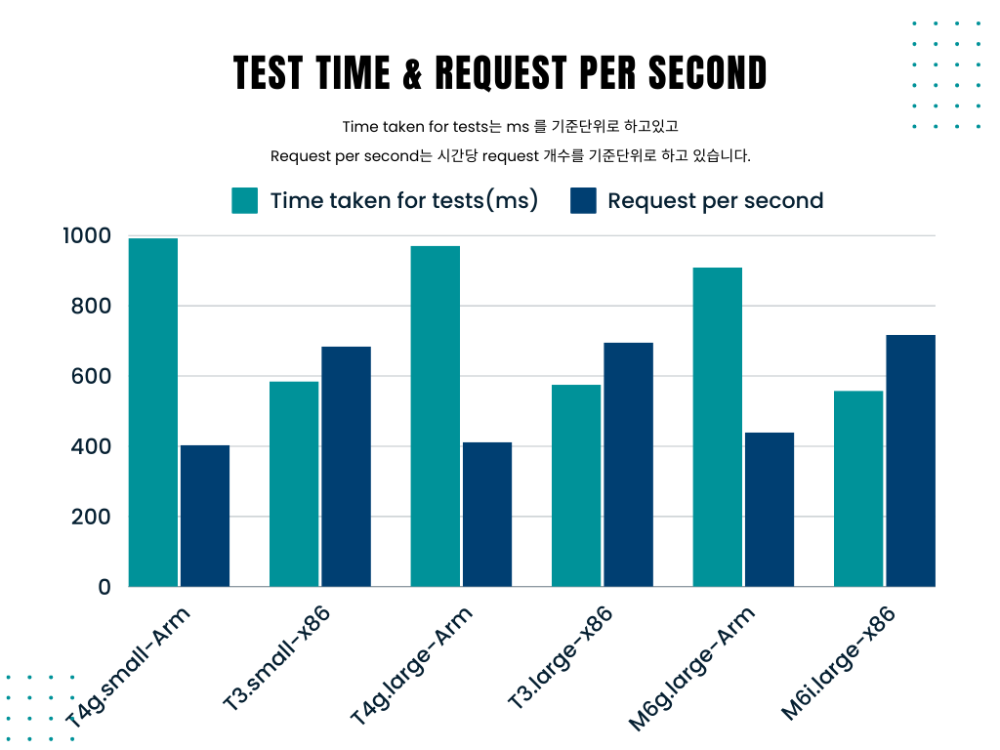

# 신한 프로디지털아카데미 4기 테스트 공간

이 공간은 신한 프로디지털아카데미 4기 수강생들을 위한 github 테스트 공간입니다. 여기에서는 다양한 테스트를 진행하고 결과를 공유할 수 있습니다.

## 💻테스트 환경

저희는 ApacheBench를 사용해서 부하 발생 테스트를 했습니다.  
동일한 환경에서 테스트하기위해 t4.nano 인스턴스틀 생성해서 테스트 했습니다.
우분투에서 아파치를 설치한 후 'ab -n A -c B http://인스턴스퍼블릭 IP주소' 명령어를 실행해서 A명의 사람이 동시에 B명 페이지에 접속한다고 가정한 상황을 테스트를 합니다.

## ⚙아키텍처

아키텍처는 64비트(x86)과 64비트(Arm)을 사용했습니다.
t4g, m6g 유형은 arm 아키텍처로 t3, m6i 유형은 x86 아키텍처로 테스트 했습니다.

## 🔎AWS EC2 인스턴스 유형 별 성능 테스트
400명이 동시 접속없이 페이지에 접속할 때
| 인스턴스-아키텍처 | Time taken for tests | Suc/Total Request | Request per second | Time per Request |
| ----------------- | -------------------- | ----------------- | ------------------ | ---------------- |
| T4g.small-Arm     | 0.992sec             | 400/400           | 403.40[#/sec]      | 2.479ms          |
| T3.small-x86      | 0.585sec             | 400/400           | 684.08[#/sec]      | 1.462ms          |
| T4g.large-Arm     | 0.971sec             | 400/400           | 411.83[#/sec]       | 2.479ms          |
| T3.large-x86      | 0.575sec             | 400/400           | 695.47[#/sec]      | 1.438ms          |
| M6g.large-Arm     | 0.909sec             | 400/400           | 439.83[#/sec]      | 2.274ms          |
| M6i.large-x86     | 0.558sec             | 400/400           | 717.26[#/sec]      | 1.394ms          |  

## 📈결과 분석

ARM 기반 아키텍처를 사용하는 t4g와 인텔의 x86 아키텍처를 사용하는 t3를 비교해보겠습니다.
표를 해석해보면 x86 아키텍처를 사용하는 t3 유형의 인스턴스가 크기에 상관없이 t4g보다 처리가 빠르다는 것을 알 수 있습니다.
구글링을 했을 땐 t4g 인스턴스가 t3 모델보다 40% 나은 성능에 20% 더 저렴하다고 하는데 결과값은 반대로 나왔습니다. 단일 코어 성능이 중요한 경우에는 인텔 x86 프로세서가 ARM 프로세서보다 성능이 더 좋을 수 있다는 챗gpt의 답변이 있었습니다.

동일한 유형에서 인스턴스 크기에 따라 비교를 해보면 인스턴스의 크기가 클수록 처리속도가 빨라지는 것을 알 수 있습니다. 
가상 CPU가 모두 2개이고 범용 목적 인스턴스의 경우 네트워크 성능이 5기가비트로 동일한 것을 고려했을 때 같은 유형, 다른 인스턴스 크기의 차이는 메모리 밖에 없어서 처리 능력 차이에는 메모리 차이에서 오는 것 아닐까 생각했습니다.

마지막으로 범용 목적 인스턴스인 t4g, t3와 메모리 최적화 목적 인스턴스인 M6g, M6i를 비교해보면, 동일한 인스턴스 크기에서 메모리 최적화 목적인 인스턴스가 더 처리 성능이 좋다는 것을 알 수 있습니다.
웹 서버는 클라이언트 요청을 처리하고 응답을 생성하기 위해 메모리를 사용하기 때문에 서버가 처리하는 요청의 양과 동시에 사용되는 메모리 양은 일반적으로 비례합니다. 그런 이유에서 메모리 특화 유형 인스턴스가 범용 목적 인스턴스보다 처리 속도가 더 빠른 것이 아닌지 추측합니다.

## x86프로세서와 arm프로세서 성능 테스트 

동시성이 1일때 x86프로세서와 arm프로세서의 성능차이가 크다고 판단되어 동시성을 올려 추가 테스트를 진행했습니다.

#### 20명이 동시에 20명 접속할 때  

| 인스턴스-아키텍처 | Time taken for tests | Request per second | Time per Request | Time per Request(across all concurrent requests) |
| ----------------- | -------------------- | ------------------ | ---------------- | ---------------- |
| M6g.large-Arm     | 0.006sec           |  3138.24[#/sec]     | 6.373ms  | 0.319ms |
| M6i.large-x86     | 0.005sec             | 4131.38[#/sec]      | 4.841ms          | 0.242ms |  

#### 400명이 동시에 40명 접속할 때

| 인스턴스-아키텍처 | Time taken for tests | Request per second | Time per Request | Time per Request(across all concurrent requests) |
| ----------------- | -------------------- | ------------------ | ---------------- | ---------------- |
| M6g.large-Arm     | 0.043sec           |  9257.76[#/sec]     | 4.321ms  | 0.108ms |
| M6i.large-x86     | 0.041sec             | 9693.21[#/sec]      | 4.127ms          | 0.103ms |

## 결과 분석

동시성을 높혔을때 프로세서의 성능 차이가 줄어드는것을 확인했습니다.  
단일 요청에 대한 처리는 x86 프로세서의 성능이 우수하나 고부하 상황에 갈 수록 두 성능의 차이가 줄어듬으로 보아   
ARM 프로세서가 멀티스레딩 처리를 효율적으로 지원하며 x86프로세서의 경우 단일 코어 성능이 뛰어나다는 결과를 도출했습니다.  
이 테스트를 통해 멀티스레딩 처리가 중요한 데이터베이스 서버, IoT 서버에서는 arm 프로세서를,  
단일 처리가 중요한 서버에는 x86프로세서가 적합하다는 것을 알 수 있습니다.  
동시성을 더 높혀 테스트 진행 시 더 유의미한 결과를 도출할 수 있을것 같습니다. 

## 기타
| 인스턴스 | 온디맨드 시간당 요금 | vCPU | 메모리 | 네트워크 성능 |
| ------- | ------------------- | ---- | ----- | --------------- |
| t4g.small | 0.0208 | 2 | 2GiB | 최대 5기가비트 |
| t4g.large | 0.832 | 2 | 8GiB | 최대 5기가비트 |
| t3.small | 0.026 | 2 | 2GiB | 최대 5기가비트 |
| t3.large | 0.104 | 2 | 8GiB | 최대 5기가비트 |
| m6g.large | 0.094 | 2 | 8GiB | 최대 10기가비트 |
| m6i.large | 0.118 | 2 | 8GiB | 최대 12,500메가비트 |
